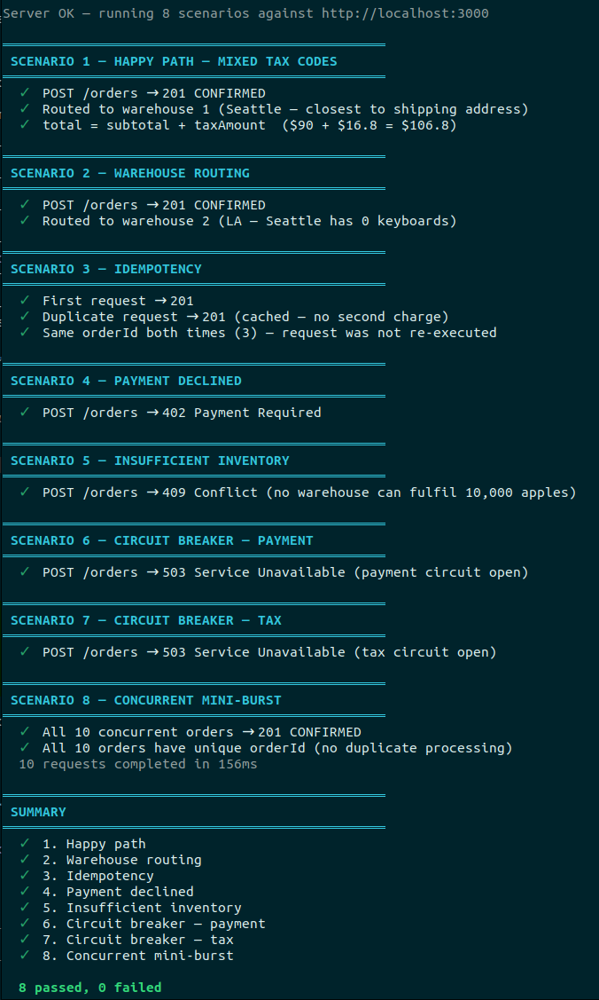
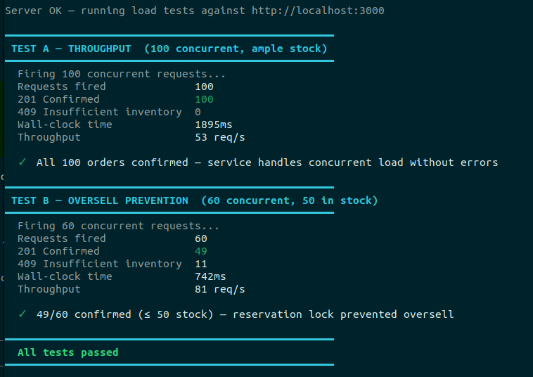

# `POST /orders` — warehouse-based order fulfillment endpoint.

## Contents

- [Overview](#overview)
- [Documentation](#documentation)
- [Prerequisites](#prerequisites)
- [Setup](#setup)
- [Demo & Load Testing](#demo--load-testing)
- [Other commands](#other-commands)

## Overview

This service exposes a single `POST /orders` endpoint for an e-commerce platform. It accepts a customer's order (shipping address, items, and payment details), selects the optimal warehouse to fulfil the order, reserves the required inventory atomically, applies jurisdiction-based tax, processes payment, and returns a confirmed order with a full receipt snapshot.

Key guarantees:

- **Inventory safety** — append-only reservation table with per-SKU PostgreSQL advisory locks prevents overselling under concurrent load.
- **Idempotency** — duplicate submissions (retries, double-clicks, network timeouts) return the original response without re-charging.
- **Financial consistency** — payment charges that cannot be immediately confirmed land in a `PENDING_PAYMENT` state and are reconciled by a background job rather than being incorrectly failed.
- **Resilience** — circuit breakers on all external gateways, retry logic for transient failures, and a dead-letter queue for unresolvable compensation failures.

## Documentation

- [DESIGN_DOC.md](DESIGN_DOC.md) — full design: architecture, schema, inventory/concurrency model, background jobs, and trade-offs.
- [docs/order-flow.md](docs/order-flow.md) — step-by-step walkthrough of the end-to-end order placement flow.
- [docs/high-traffic-assessment.md](docs/high-traffic-assessment.md) — load-test findings and the high-traffic concurrency analysis.
- [docs/assignment.md](docs/assignment.md) — the original assignment brief.

## Prerequisites

- Node.js 20+
- PostgreSQL 16
- Redis

## Setup

### 1. Install dependencies

```bash
npm install
```

### 2. Create the database

```bash
createdb orders_dev
```

### 3. Configure environment

```bash
cp .env.example .env
```

Edit `.env` and fill in the values for your local environment:

```
DB_HOST=localhost
DB_PORT=5432
DB_NAME=orders_dev
DB_USER=<your database username>
DB_PASSWORD=<your database password>
REDIS_URL=redis://localhost:6379
```

> `REDIS_URL` must be set even when only running migrations — the app validates all env vars at startup. Redis does not need to be running for migrations to work, only for the server.

### 4. Run migrations

```bash
npm run migration:run
```

To roll back the last migration:

```bash
npm run migration:revert
```

### 5. Seed the database

```bash
npm run seed
```

### 6. Start the development server

```bash
# Make sure Redis is running first
redis-server --daemonize yes

npm run dev
```

## Demo & Load Testing

Two scripts exercise the live `POST /orders` service end to end — over real HTTP against a running server, with no mocking or test doubles. They are the quickest way to see the feature working and to verify its key guarantees under concurrency. Full details are in [src/demo/README.md](src/demo/README.md).

### Setup

```bash
# 1. Migrate and seed the database (one-time)
npm run migration:run
npm run seed

# 2. Start the server with the rate limit relaxed (separate terminal)
RATE_LIMIT_MAX=1000 npm run dev
```

> Each run consumes real inventory — re-run `npm run seed` if stock runs low before re-running a script.

### `demo` — feature walkthrough

```bash
npm run demo
```

Steps through 8 scenarios with colour-coded pass/fail output, proving the core behaviours: happy-path ordering with tax, closest-warehouse routing, idempotent retries (no double-charge), payment-decline with reservation release, insufficient-inventory rejection, payment/tax circuit breakers, and a concurrent burst confirming with unique order IDs.



### `load-test` — concurrency & oversell prevention

```bash
npm run load-test
```

Runs two back-to-back tests against a live server:

- **Throughput** — 100 concurrent orders fired simultaneously; asserts all confirm and reports requests/second.
- **Oversell prevention** — 60 concurrent orders against 50 units of stock; asserts confirmed orders never exceed available stock, demonstrating the per-SKU advisory lock prevents overselling under race conditions.



## Other commands

```bash
npm run typecheck   # TypeScript type-check (no emit)
npm test            # Run tests (Vitest)
npm run lint        # ESLint
npm run format      # Prettier
```
