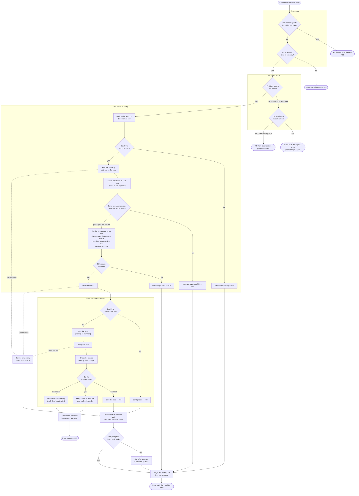
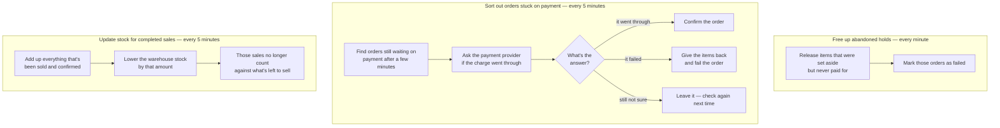

# `POST /orders` — End-to-End Flow

This document traces a single order from the moment a customer submits it to the moment it's
confirmed, plus the background tasks that tidy up afterwards. Diagrams are
[Mermaid](https://mermaid.js.org/) and render natively on GitHub.

---

## 1. Placing an order (what happens during the request)

### A few things worth knowing

- **Set items aside early.** Stock is reserved *before* tax and payment, so we fail fast if it's
  not available and never leave a half-finished order holding stock it can't pay for.
- **One order at a time per product.** When lots of orders race for the same item, they take turns
  instead of all grabbing the last unit — this is what stops us from selling more than we have.
- **"Couldn't tell" is not a failure.** If we can't confirm the charge right away, we leave the
  order *waiting* (and still tell the customer it's placed). A background task checks again later,
  so we never wrongly fail a charge that may have actually succeeded.
- **Sent twice? Charged once.** The very first attempt for an order is the only one that does the
  work; a repeat gets the original answer back, and a failed attempt can be safely retried.

### What each result code means

| Result | Cause |
|---|---|
| `201` Order placed | Confirmed, or accepted and waiting on payment |
| `201`/`200` (repeat) | Same order sent twice — original answer replayed |
| `400` Bad request | The request wasn't filled in correctly |
| `402` Payment needed | The card was declined |
| `409` Conflict | No warehouse can fill it, not enough stock, or the order is already in progress |
| `422` Can't process | We couldn't work out the tax |
| `429` Too many requests | The customer is sending requests too fast |
| `503` Unavailable | A service we depend on (payment, tax, or address lookup) is temporarily down |
| `500` Error | Something unexpected went wrong |

---

## 2. Background tidy-up (what finishes the job afterwards)

These run on a schedule and clean up anything the live request left open: items held but never
paid for, orders stuck waiting on payment, and stock that needs updating after a sale completes.

- **Free up abandoned holds** — items set aside for an order that never got paid go back on the
  shelf, and the order is marked failed.
- **Sort out stuck orders** — the safety net for the "couldn't tell" case above: ask the payment
  provider again and either confirm or unwind the order.
- **Update stock for completed sales** — once a sale is confirmed, the warehouse count is brought
  down to match, so finished sales stop counting against what's available to buy.
